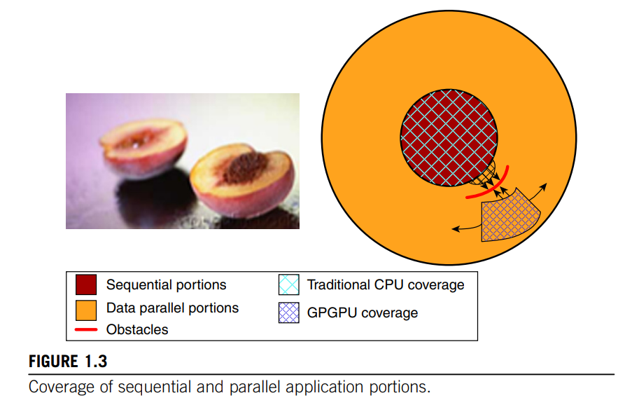

# 001 GPU基础/为什么要学习cuda编程

## 典型的CUDA GPU架构

典型 CUDA GPU 的架构以**高度线程化（highly-thread）的流式多处理器（Streaming Multiprocessors, SMs）** 为核心构建，整体结构呈现 “模块化、可扩展” 的特点，具体组成与功能如下：

## **一、CUDA GPU 核心架构：以 “流式多处理器” 为基础的并行单元**

典型 CUDA GPU 的架构以**高度线程化的流式多处理器（Streaming Multiprocessors, SMs）** 为核心构建，整体结构呈现 “模块化、可扩展” 的特点，具体组成与功能如下：

### **1. 核心组成单元：SM 与 SP 的层级关系**

- **流式多处理器（SM）**：SM 是 GPU 的 “并行计算核心”，多个 SM 以阵列形式组成 GPU 的计算主体。不同代际的 CUDA GPU 中，SM 的 “组合方式” 存在差异 —— 如图 1.3 所示，某代 GPU 以 “2 个 SM 构成一个基础模块”，但模块内的 SM 数量会随架构迭代调整（例如后续代际可能为 4 个 SM 一组）。
- **流式处理器（Streaming Processors, SPs）**：每个 SM 内部包含多个 SP，SP 是执行具体算术运算（如浮点计算、整数计算）的 “最小单元”。所有 SP 共享 SM 内的控制逻辑与指令缓存，确保同一 SM 内的线程能高效执行相同指令（适配 “单指令多数据，SIMD” 的并行模式）。

这种 “SM 阵列 + SP 共享资源” 的设计，既保证了大规模并行计算的能力（通过大量 SM 和 SP 实现），又通过资源共享（控制逻辑、指令缓存）降低了硬件冗余，平衡了性能与成本。

### **2. 全局内存（Global Memory）：高带宽的数据存储核心**

GPU 配备的**图形双倍数据速率内存（Graphic Double Data Rate, GDDR DRAM）**，在 CUDA 编程模型中被称为 “全局内存”（如图 1.3 所示），是支撑数据密集型并行计算的关键：

- **硬件特性**：当前 GPU 的全局内存容量通常为 “数 GB 级别”，其本质是图形应用中的 “帧缓冲内存”（用于存储视频图像、3D 渲染的纹理信息），但在计算场景下，可作为 “高带宽片外内存” 使用。
- **性能特点**：
    - **高带宽优势**：GDDR 内存的带宽远高于 CPU 主板上的系统内存（如 G80 的内存带宽达 86.4 GB/s，GTX 680 达 200 GB/s），能满足海量线程同时读取数据的需求；
    - **延迟权衡**：其访问延迟略高于 CPU 系统内存，但对 “大规模并行应用” 而言，高带宽可通过 “多线程并行执行” 掩盖延迟（即部分线程等待内存时，其他线程继续计算），最终整体吞吐量仍远超 CPU。

## **二、CPU 与 GPU 的通信：PCI-Express 接口的演进**

CUDA 应用需在 CPU（主机端）与 GPU（设备端）之间传输数据，两者通过**PCI-Express（PCI-E）接口**通信，接口带宽随代际升级不断提升，直接影响异构计算的效率：

- **PCI-E Gen2（早期 GPU）**：双向带宽均为 4 GB/s，即 CPU 向 GPU 的全局内存传输数据速率为 4 GB/s，GPU 向 CPU 的系统内存回传数据速率也为 4 GB/s，总双向带宽达 8 GB/s。
- **PCI-E Gen3（近期 GPU）**：双向带宽均提升至 8 GB/s，进一步减少数据传输的瓶颈 —— 随着 GPU 全局内存容量的增长，应用可将大部分数据常驻于 GPU 内存中，仅在需要调用 “CPU 专属库” 时，通过 PCI-E 少量传输数据，最大化减少通信开销。

未来，随着 CPU 系统内存总线带宽的提升，PCI-E 接口的通信带宽也将进一步增长，持续优化 CPU 与 GPU 的协同效率。

## **三、GPU 的并行能力：线程规模与计算性能的突破**

GPU 通过 “支持海量线程” 和 “高浮点运算能力”，实现了远超 CPU 的并行性能，具体表现可通过典型硬件参数体现：

- **线程支持规模**：以 GTX 680 为例，其支持的线程总数达 16,384 个，实际应用中通常可同时运行 5,000-12,000 个线程 —— 这与 CPU 的线程支持能力形成巨大差距：CPU 每核心仅支持 2-4 个线程（取决于具体型号，如 Intel 的超线程技术），即使是 8 核 CPU，总线程数也仅为 16-32 个，不足 GPU 的 1%。
- **浮点计算性能**：GTX 680 的双精度浮点运算性能超过 1.5 TFLOPS（每秒万亿次浮点运算），且如前文所述，其双精度速度已达单精度的约 50%，能满足科学计算、工程模拟等对精度要求高的场景。

### **关键对比：GPU 与 CPU 的并行模式差异**

CPU 虽也通过 “SIMD 指令”（单指令多数据）提升数值性能，但并行层级与 GPU 完全不同：

- CPU 的 SIMD 是 **“单核心内的向量并行”**（如一次处理 8 个 float 类型数据），本质仍是 **“少量线程 + 向量加速”；**
- GPU 的并行是 **“海量线程 + 多核心并行”**，每个线程可独立执行任务，且 SM 间、SP 间可同时处理不同数据，**并行粒度更细、规模更大。**

这一差异决定了：**应用的并行度越高，GPU 的性能优势越明显**—— 因此，开发计算应用时，“追求高并行度” 已成为充分发挥硬件性能的核心原则。

## **总结：GPU 架构设计的核心逻辑**

CUDA GPU 的架构设计围绕 “大规模并行计算” 展开：以 SM 和 SP 为核心构建计算单元，通过 GDDR 内存提供高带宽数据支撑，借助 PCI-E 接口实现与 CPU 的高效通信，最终通过 “海量线程支持” 和 “高浮点性能”，突破 CPU 在并行计算上的瓶颈。这种设计精准适配了 “数据密集、高并行” 的应用场景，也为异构并行计算的普及奠定了硬件基础。

## 四、异构并行计算

**异构计算的价值**：只有让**CPU 处理 “串行部分”**，**GPU（或 GPGPU，尤其是现代 CUDA GPU）处理 “数据并行部分”**，才能完整覆盖应用程序的所有任务，实现整体性能最优 —— 这也是 “CPU + GPU 协同的异构并行计算” 成为主流的核心原因。

💡

需注意，相较于单核 CPU 执行，最终实现的加速比也能反映出 CPU 对该应用的适配程度：在某些应用中，CPU 本身性能表现就十分出色，这使得利用 GPU 提升性能的难度更大。大多数应用都包含一些更适合由 CPU 执行的代码段。因此，**必须为 CPU 提供充分发挥性能的机会，并且确保代码编写时能让 GPU 对 CPU 的执行起到补充作用，从而充分利用 CPU 与 GPU 组合系统所具备的异构并行计算能力。**这也正是 CUDA 编程模型所倡导的理念。

图 1.3 展示了典型应用的主要构成部分。

一个实际应用的大部分代码往往是串行的，这些**串行部分在图中被描绘成桃子的 “果核” 区域** —— 试图对这些部分采用并行计算技术，就如同去啃桃核一样，体验极差！

这类代码段很难实现并行化，而 CPU 在执行串行代码方面通常表现优异。好消息是，尽管这些串行代码可能占据应用代码总量的很大比例，但在 “超级应用” 的总执行时间中，它们往往只占很小一部分。

**接下来是我们所说的 “桃肉” 区域对应的代码段。**这类代码段很容易实现并行化，早期的一些图形类应用程序也具备这一特性。**在异构计算系统中，通过并行编程可以极大地提升这类应用的性能。**正如图 1.3 所示，早期的通用图形处理器（GPGPU）仅能覆盖 “桃肉” 区域的一小部分，这就好比它们只能支持那些最具吸引力的应用中的一小部分功能。

**CUDA 编程模型的设计目标就是覆盖 “超级应用” 中 “桃肉” 区域的更大范围。**